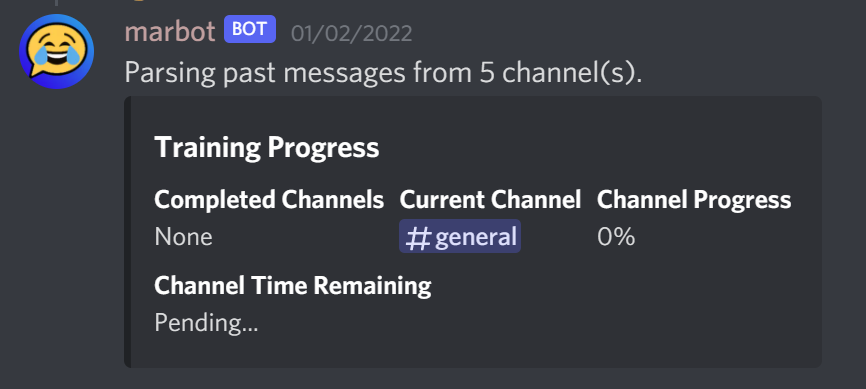

# MarkBot for Discord

A Markov chain bot using markov-strings.

QQ Version contains an auto post mechanism, a limit on the number of messages it will use to train, and a system to retry generation if a proposed generated message is a duplicate of one of the reference inputs

## Usage

1. Configure what channels you want the bot to listen/learn from:
    * User: `/listen modify`
    * Bot: 
1. Train the bot in a lengthy text channel:
    * User: `/train`
    * Bot: 
1. Ask the bot to say something:
    * User: `/mark`
    * Bot: 

## Setup

This bot stores your Discord server's entire message history, so a public instance to invite to your server is not available due to obvious data privacy concerns. Instead, you can host it yourself.

1. Create a [Discord bot application](https://discordapp.com/developers/applications/)
1. Under the "Bot" section, enable the "Message Content Intent", and copy the token for later.
1. Setup and configure the bot using one of the below methods:

### Docker

Running this bot in Docker is the easiest way to ensure it runs as expected and can easily recieve updates.

1. [Install Docker for your OS](https://docs.docker.com/get-docker/)
1. Open a command prompt and run:

    ```sh
    docker run --restart unless-stopped --rm -ti -v /my/host/dir:/usr/app/config ghcr.io/claabs/markov-discord:latest
    ```

    Where `/my/host/dir` is a accessible path on your system. `--restart=unless-stopped` is recommended in case an unexpected error crashes the bot.
1. The Docker container will create a default config file in your mounted volume (`/my/host/dir`). Open it and add your bot token. You may change any other values to your liking as well. Details for each configuration item can be found here: <https://claabs.github.io/markov-discord/classes/AppConfig.html>
1. Run the container again and use the invite link printed to the logs.

### Windows

1. Install [Node.js 16 or newer](https://nodejs.org/en/download/).
1. Download this repository using git in a command prompt

    ```cmd
    git clone https://github.com/claabs/markov-discord.git
    ```

    or by just downloading and extracting the [project zip](https://github.com/claabs/markov-discord/archive/master.zip) from GitHub.
1. Open a command prompt in the `markov-discord` folder.

    ```sh
    # NPM install non-development packages
    npm ci
    # Build the Typescript
    npm run build
    # Initialize the config
    npm start
    ```

1. The program will create a `config/config.json` in the project folder. Open it and add your bot token. You may change any other values to your liking as well. Details for each configuration item can be found here: <https://claabs.github.io/markov-discord/classes/AppConfig.html>
1. Run the bot:

    ```sh
    npm start
    ```

    And use the invite link printed to the logs.
